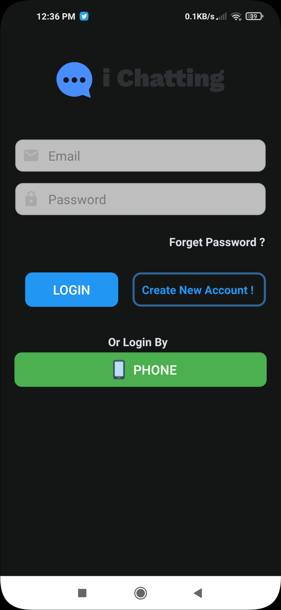
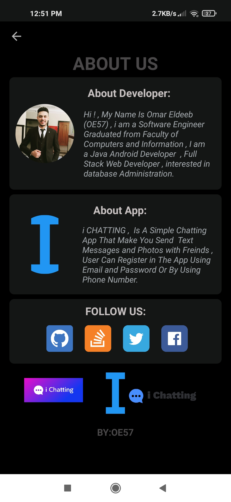
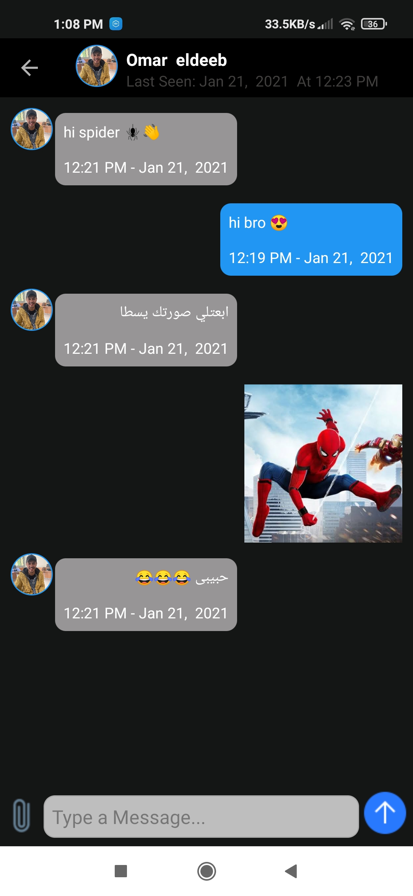

# i-chatting-app
simple chatting app enable you to send text messages or images with friends using real time database , user can register in the app using phone number or email&amp;password
=> app support:
- email & password authentication
- phone authentication
- real time database'
- firebase storage
# Ui
,
,
,
,
,
,
,

